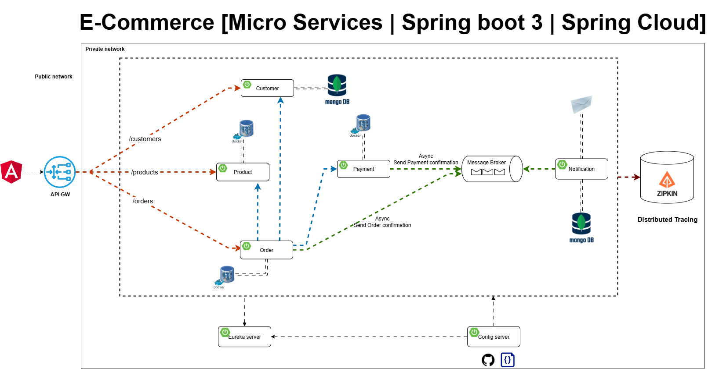

# 🛒 E-Commerce Java Microservices

A modular, production-grade e-commerce system built with **Spring Boot**, **Spring Cloud**, and **Docker**, designed to demonstrate microservice orchestration, distributed tracing, and secure payment processing.

## 🖼️ Diagram



## 🚀 Features

- **Order Management**: Create orders, manage line items, and track status.
- **Product Service**: Handles inventory, product details, and purchase logic.
- **Customer Service**: Validates and retrieves customer information.
- **Payment Service**: Processes payments with support for multiple methods.
- **Email Service**: Sends confirmation emails using templated HTML.
- **Notification Producer**: Publishes order events via Kafka.
- **Distributed Tracing**: Integrated with Zipkin for full traceability.
- **Auditing**: Tracks creation and modification timestamps via JPA auditing.
- **Validation**: Robust request validation using annotations and custom exceptions.

## 🧱 Tech Stack

| Layer            | Technology                          |
|------------------|--------------------------------------|
| Backend          | Java 17, Spring Boot 3               |
| Microservices    | Spring Cloud, OpenFeign              |
| Messaging        | Apache Kafka                         |
| Database         | PostgreSQL                           |
| Tracing          | Zipkin, Spring Sleuth                |
| Email            | Spring Mail + Mailtrap (local dev)  |
| Containerization | Docker, Docker Compose               |

## 📦 Modules

- `product-service`
- `order-service`
- `payment-service`
- `email-service`
- `customer-service`
- `notification-producer`

## 🧪 Running Locally

1. **Start Docker services**:
   ```bash
   docker-compose up
   ```

2. **Run Spring Boot apps**:
   Each service can be started individually via your IDE or CLI.

3. **Access Zipkin UI**:
   ```
   http://localhost:9411
   ```

4. **View Mailtrap inbox**:
   ```
   http://localhost:8025
   ```

## 📬 Sample Order Request

POST http://localhost:8222/api/v1/orders
```json
{
  "reference": "ORD-20250512-001",
  "amount": 59.99,
  "paymentMethod": "CREDIT_CARD",
  "customerId": "68732b84d17b787f19102cde",
  "products": [
    {
      "productId": 751,
      "quantity": 1
    },
    {
      "productId": 1101,
      "quantity": 1
    }
  ]
}
```

## 🛡️ Security & Observability

- Uses `@Transactional` for atomic operations.
- Validates input with `@Valid`, `@NotBlank`, `@Positive`, etc.
- Publishes `OrderConfirmation` events for downstream consumers.
- Traces every request across services using Sleuth + Zipkin.

## 📚 Documentation

- Swagger/OpenAPI integration coming soon.
- For now, explore controller classes for endpoint mappings.

## 👨‍💻 Author

Created by [Qi](https://github.com/Aixinjueluoqi), software engineer at Microsoft, passionate about distributed systems, observability, and clean architecture.

---

```